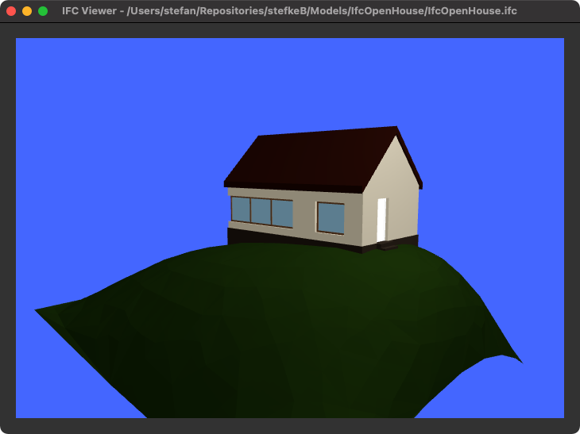

# 3D Geometry Examples

These are basic examples of parsing the 3D geometry from an IFC file, using PyQt and IfcOpenShell.

## Qt3d_minimal.py

This is a minimal example of a 3D widget, using the Qt3d-libraries from the QtSDK.

It parses the IFC-file with the `geom` library from IfcOpenShell, which returns a polygonal representation for each object. This is then translated into `QEntity` items in a Qt3d scenegraph.

