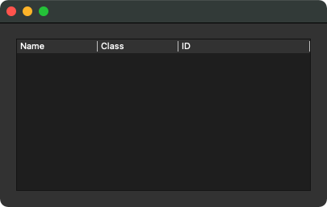

# GUI Treeviewer Example

This is a basic example of a GUI IFC application, written in Python and using the ifcopenshell library. The Graphical User Interface uses the Qt libraries, more in particular the PyQt5 library. As an alternative and with minimal code changes, it can also use the PySide libraries.

It is not a full viewer, but uses a Tree widget to display the Spatial hierarchy. This example follows the same approach as the [minimal console](../Console/README.md).


## First steps - preparation

Create a file called `ifc_treeviewer.py`. Its main skeleton launches an application which displays a custom `QWidget`. You can run it as follows:

```
python ifc_treeviewer.py IfcOpenHouse.ifc
```

The main application simply displays an empty `QWidget` derived custom class for now. It also has a function available to load the file we have provided via the command line argument.

```python
import sys
import os.path
from PyQt5.QtWidgets import *
import ifcopenshell


class Window(QWidget):
	def __init__(self):
		QWidget.__init__(self)
		# Do something
		
	def load_file(self, filename):
		# Import the IFC File
		self.ifc_file = ifcopenshell.open(filename)


if __name__ == '__main__':
	app = 0
	if QApplication.instance():
		app = QApplication.instance()
	else:
		app = QApplication(sys.argv)

	w = Window()
	w.resize(600, 800)
	filename = sys.argv[1]
	if os.path.isfile(filename):
		w.load_file(filename)
		w.show()
	sys.exit(app.exec_())   
```

If you run it now, a single window appears, without any UI widgets. Not that interesting.

## Use a QTreeWidget for the Spatial Hierarchy

In the `__init__` method, we prepare a `QTreeWidget` which provides us with a tree we can later fill with our elements.

```python
	def __init__(self):
		QWidget.__init__(self)
		# Prepare Tree Widgets in a stretchable layout
		vbox = QVBoxLayout()
		self.setLayout(vbox)
		# Object Tree
		self.object_tree = QTreeWidget()
		vbox.addWidget(self.object_tree)
		self.object_tree.setColumnCount(3)
		self.object_tree.setHeaderLabels(["Name", "Class", "ID"])
```

This gives us an empty tree which fills the stretchable window.



In the `load_file` method we send the filename we got from the command line 


```python
	def load_file(self, filename):
		# Import the IFC File
		self.ifc_file = ifcopenshell.open(filename)
		root_item = QTreeWidgetItem(
			[self.ifc_file.wrapped_data.header.file_name.name, 'File', ""])
		# Finish the GUI
		self.object_tree.addTopLevelItem(root_item)
```

When you run it now, you'll get the root item in the tree which refers to our IFC file.


## Follow the two main relations

Now we can start running through the one and only `IfcProject` and follow the two main relationships to get to its children. We use a separate method `add_object_in_tree`_, which can be called recursively to fill the tree with items. It requires a reference to the object and a reference to the `QTreeWidgetItem` to which it will be attached.


```python
	def load_file(self, filename):
		# Import the IFC File
		self.ifc_file = ifcopenshell.open(filename)
		root_item = QTreeWidgetItem(
			[self.ifc_file.wrapped_data.header.file_name.name, 'File', ""])
		for item in self.ifc_file.by_type('IfcProject'):
			self.add_object_in_tree(item, root_item)
		# Finish the GUI
		self.object_tree.addTopLevelItem(root_item)
		self.object_tree.expandToDepth(3)
```

This new method `add_object_in_tree` is the equivalent of the `print_hierarchy` method in the console example.

We start by creating a `QTreeWidgetItem` which gets as input a list of strings (the values in each column of the widget) and then add it as a child to the parent we were given.

In contrast with the version in our console example, the code is slightly adjusted: instead of checking on the entity class with the `.is_a()` method, we call the `hasattr(object,<attribute>)` utility method. This checks if the attribute exists, before we actually use it. This way, the code will work for any class which has this attribute available, not just the ones from the class we had foreseen.

Secondly, the way to go through the lists is also more compact, so we don't need an intermediate variable anymore for the list of related elements or objects.


```python
	def add_object_in_tree(self, ifc_object, parent_item):
		tree_item = QTreeWidgetItem([ifc_object.Name, ifc_object.is_a(), ifc_object.GlobalId])
		parent_item.addChild(tree_item)
		if hasattr(ifc_object, 'ContainsElements'):
			for rel in ifc_object.ContainsElements:
				for element in rel.RelatedElements:
					self.add_object_in_tree(element, tree_item)
		if hasattr(ifc_object, 'IsDecomposedBy'):
			for rel in ifc_object.IsDecomposedBy:
				for related_object in rel.RelatedObjects:
					self.add_object_in_tree(related_object, tree_item)
```

## Result

Run the script again and now the Tree widget is filled with all elements, starting from the Project, down to the Site, Building and Storeys, or whatever Spatial Structure that was used in the IFC-file.


Beware that not all objects received a name in the example file, so they remain as empty cells. Here is the full listing or you can [download the file here](ifc_treeviewer.py).


```python
import sys
import os.path
from PyQt5.QtWidgets import *
import ifcopenshell


class Window(QWidget):
	def __init__(self):
		QWidget.__init__(self)
		# Prepare Tree Widgets in a stretchable layout
		vbox = QVBoxLayout()
		self.setLayout(vbox)
		# Object Tree
		self.object_tree = QTreeWidget()
		vbox.addWidget(self.object_tree)
		self.object_tree.setColumnCount(3)
		self.object_tree.setHeaderLabels(["Name", "Class", "ID"])

	def load_file(self, filename):
		# Import the IFC File
		self.ifc_file = ifcopenshell.open(filename)
		root_item = QTreeWidgetItem(
			[self.ifc_file.wrapped_data.header.file_name.name, 'File', ""])
		for item in self.ifc_file.by_type('IfcProject'):
			self.add_object_in_tree(item, root_item)
		# Finish the GUI
		self.object_tree.addTopLevelItem(root_item)
		self.object_tree.expandToDepth(3)

	def add_object_in_tree(self, ifc_object, parent_item):
		tree_item = QTreeWidgetItem([ifc_object.Name, ifc_object.is_a(), ifc_object.GlobalId])
		parent_item.addChild(tree_item)
		if hasattr(ifc_object, 'ContainsElements'):
			for rel in ifc_object.ContainsElements:
				for element in rel.RelatedElements:
					self.add_object_in_tree(element, tree_item)
		if hasattr(ifc_object, 'IsDecomposedBy'):
			for rel in ifc_object.IsDecomposedBy:
				for related_object in rel.RelatedObjects:
					self.add_object_in_tree(related_object, tree_item)


if __name__ == '__main__':
	app = 0
	if QApplication.instance():
		app = QApplication.instance()
	else:
		app = QApplication(sys.argv)

	w = Window()
	w.resize(600, 800)
	filename = sys.argv[1]
	if os.path.isfile(filename):
		w.load_file(filename)
		w.show()
	sys.exit(app.exec_())
```