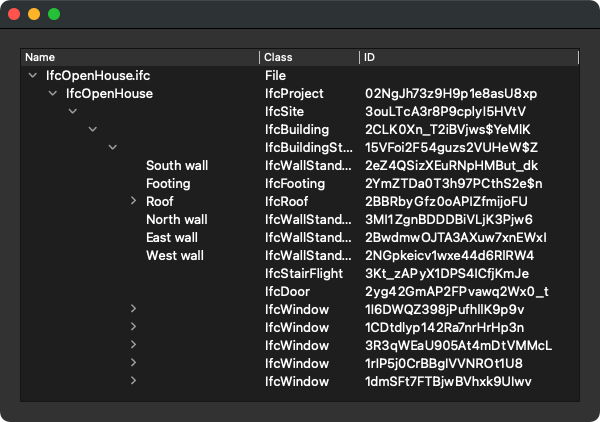

# GUI Treeviewer Example

These are basic examples of GUI IFC applications, written in Python and using the ifcopenshell library. The Graphical User Interface uses the Qt libraries, more in particular the PyQt5 library. As an alternative and with minimal code changes, it can also use the PySide2 libraries.

## ifc_treeviewer.py

This is not a full viewer, but uses a basic `QTreeWidget` to display the Spatial hierarchy (decomposition and containment).

## ifc_treeviewer2.py

This is a more advanced viewer, where a second tree is used to display type, properties, quantities and attributes of the object selected in the first tree.

