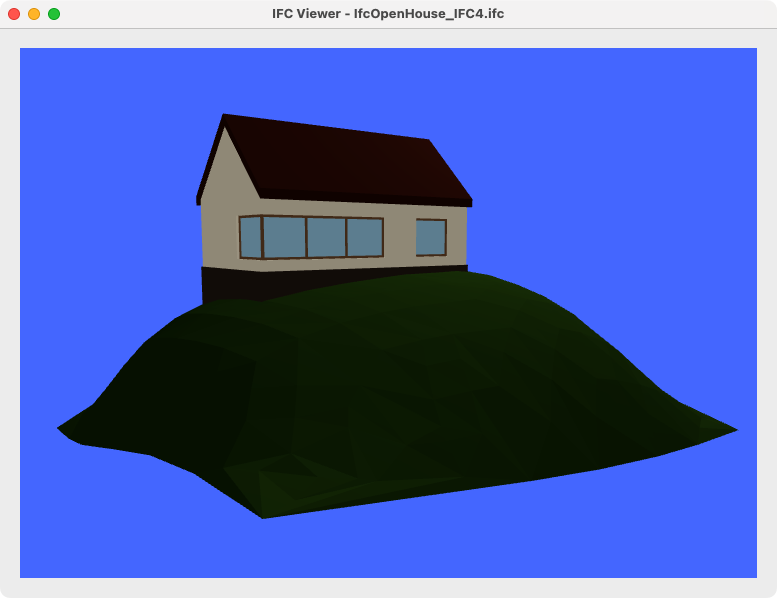

# IfcOpenShell Examples

Series of examples on how to use [IfcOpenShell](https://github.com/IfcOpenShell/IfcOpenShell) as a general-purpose IFC library.

Primary focus is on Python examples, with and without graphical interface.
See the Wiki for more in-depth explanation for the different examples.

A second objective is to collect all examples into one, more comprehensive IFC-viewer.

**Note:** The library was originally written for PyQt5, but this (current) branch switches to PySide6. Console and basic GUI tools don't require many changes, but the Qt3D library has moved things around, making code incompatible between the two variants of PyQt/PySide, alas.

## Setup instructions

Use pip to install PyQt6 and the additional 3D libraries:

```sh
pip install pyqt6 pyqt6-3d
```

Alternatively, you can also select PySide6, which includes PySide6-Essentials and PySide6-Addons (default Qt6 based Python wrapper):

```sh
pip install pyside6
```

If you use a package manager such as mamba, or anaconda, it could look like this:

```sh
micromamba create -n bim python=3.12
micromamba activate bim
pip install pyside6==6.6 lark ifcopenshell
```

You can run the basis minimal Qt3d example using the [IfcOpenHouse_IFC4.ifc](https://github.com/aothms/IfcOpenHouse) model from the ifcopenshell library as such:

```sh
python 3D/qt3d_minimal.py IfcOpenHouse_IFC4.ifc
```



The more elaborate viewer in `Viewer/IFCQt3DView.py` requires the [PythonOcc-Core](https://github.com/tpaviot/pythonocc-core) libraries. They can also be installed as follows:

```sh
micromamba install pythonocc-core
```

Beware, however that the OCC (OpenCascade wrapper) may be specific to a particular release of the OpenCascade libraries and you may have to search for a combination of ifcopenshell and OCC which are aligned. Since we weren't always succesful in compiling everyting, we made the use of OCC optional in the code, although that did introduce some additional code changes along the way.
