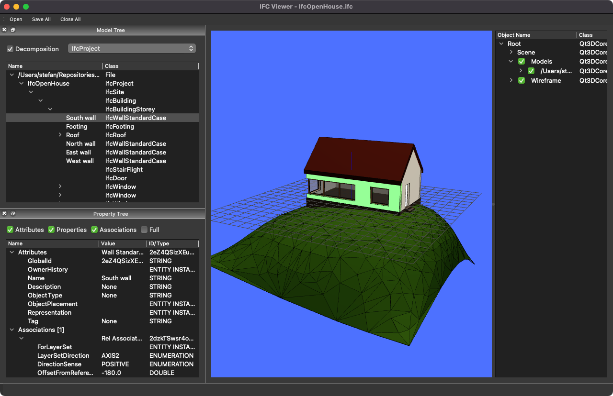

# IFC Viewer

## QIFCViewer.py

The main window of a basic IFC viewer. This collects all views, widgets and manages the loading of models in IFC-format.

## IFCQt3DView.py

A 3D viewer widget, using the Qt3d-libraries from the QtSDK.
It parses the IFC-file with the `geom` library from IfcOpenShell, which returns a polygonal representation for each object. This is then translated into `QEntity` items in a Qt3d scene-graph. It can be slow for certain objects (e.g., furniture objects with lots of vertices and different colors).
In addition, due to performance reasons, also the `OCC` library (a Python wrapper for OpenCASCADE) is required.

* IFC File Loading, geometry parsing & (very) basic navigation
* Wireframe (edges) display, Origin and Axis
* Object Picking + Selection syncing + Scene-Graph viewer

## IFCTreeWidget.py

A widget to contain a Spatial Tree

* Object Tree (model decomposition)
* Selection Syncing (with the 3D View)
* Editing object names

## IFCPropertyWidget.py

A widget to contain information about objects or files

* Property Tree (attributes, properties, quantities, type, associations, assignments)
* File Header display