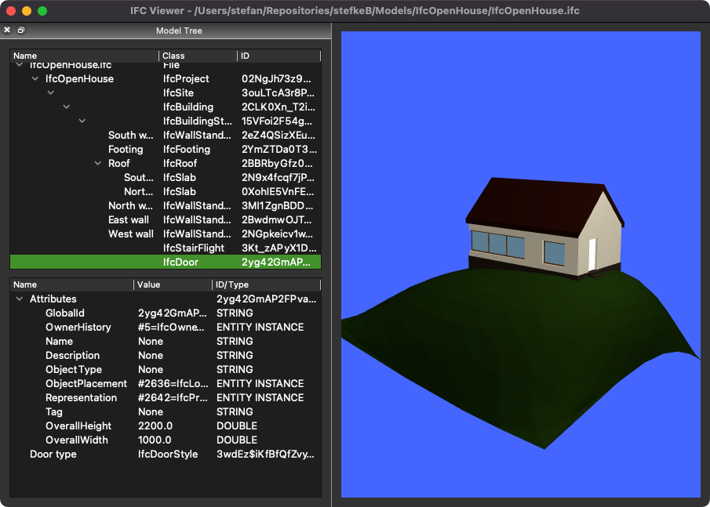

# IFC Viewer

## QIFCViewer.py

The main window of a basic IFC viewer. This collects all views, widgets and manages the loading of models in IFC-format.

## IFCQt3DView.py

A 3D viewer widget, using the Qt3d-libraries from the QtSDK.
It parses the IFC-file with the `geom` library from IfcOpenShell, which returns a polygonal representation for each object. This is then translated into `QEntity` items in a Qt3d scene-graph. It can be slow for certain objects (e.g., furniture objects with lots of vertices and different colors).
In addition, due to performance reasons, also the `OCC` library (a Python wrapper for OpenCASCADE) is required.

* V1 = IFC File Loading, geometry parsing & basic navigation
* V2 = Adding Edge display
* V3 = Draw an Origin and Axis
* V4 = Object Picking + Selection syncing + Scene-Graph viewer

## IFCTreeWidget.py

A widget to contain both a Spatial Tree and a separate Tree to visualise properties and attributes.

* V1 = Single Tree (object & basic hierarchy)
* V2 = Double Tree (type, properties, quantities, attributes)
* V3 = Selection Syncing (for the 3D View)