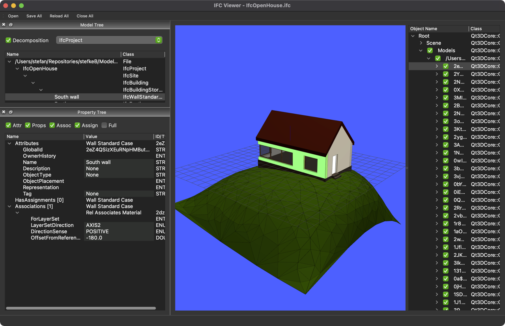
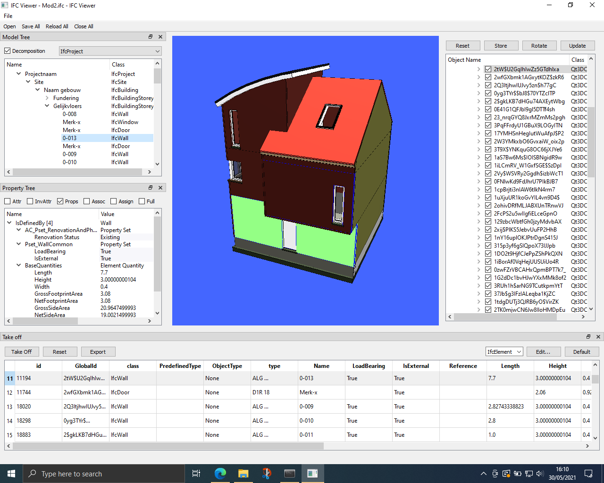

# Viewer for IFC Files

## QIFCViewer.py

The main window of a basic IFC viewer. This collects all views, widgets and manages the loading of models in IFC-format.
This class is responsible for file loading and linking the widgets together using the Qt Signals & Slots mechanism.

You can also save and reload all files (e.g., after you edited some values).

## IFCQt3DView.py

A 3D viewer widget, using the Qt3d-libraries from the QtSDK.
It parses the IFC-file with the `geom` library from IfcOpenShell, which returns a polygonal representation for each object. This is then translated into `QEntity` items in a Qt3d scene-graph. It can be slow for certain objects (e.g., furniture objects with lots of vertices and different colors).
In addition, due to performance reasons, also the `OCC` library (a Python wrapper for OpenCASCADE) is required.

* IFC File Loading, geometry parsing & (very) basic navigation
* Wireframe (edges) display, Origin and Axis
* Object Picking + Selection syncing with other views
* Basic Scene-Graph viewer (with Toggles to control visibility)

## IFCTreeWidget.py

A widget to contain a Spatial Tree

* Object Tree (with switchable model decomposition on/off)
* Selection Syncing with other views
* Editing object names
* A dropdown to pick any of the classes in the file to use as the "root" of the tree

## IFCPropertyWidget.py

A widget to display information about selected objects

* Property Tree (attributes, inverse attributes, properties, quantities, type, associations, assignments)
* File Header display (when selecting the top of the tree)
* Configurable display (toggles + the "full" option to go really deep)
* Editing of STRING, DOUBLE, INT and ENUMERATION values

## IFCListingWidget.py

A Takeoff table, to display attributes, properties or quantities

* Editable Dropdown to set the main class filter (can be abstract)
* Default set of headers to get you started
* Editor to adjust the headers and control the filter
* Editing of STRING, DOUBLE, INT and ENUMERATION values for attributes and properties

## IFCCustomDelegate.py

A series of convenience functions to support information extraction and editing

* Extract properties, quantities and attributes by name
* Make a summary text to display in tooltips
* Make a "friendly" name from an IFC class, removing 'ifc' and splitting by capital letters (e.g. 'IfcRelAggregates' becomes 'Rel Aggregates')
* Custom delegate class to edit individual attributes, using some hints when building up the trees

# Example running on Windows

